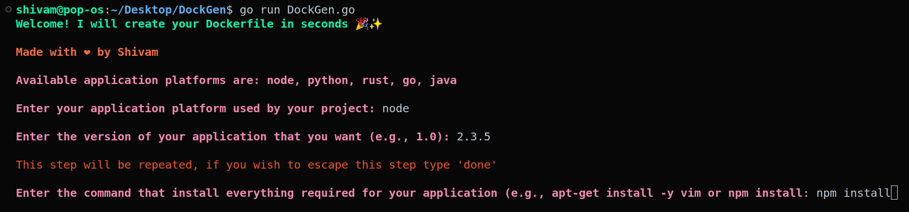
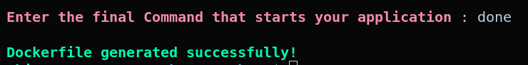

# DockGen - Creating Dockerfiles Made Simple 🔥🔥

## Overview

Welcome to DockGen! This command-line interface (CLI), written in Go, simplifies the process of creating Dockerfiles for popular programming languages such as Node.js, Python, Rust, Go, and Java. Generate Dockerfiles effortlessly with interactive prompts tailored to your project requirements.

## Features

- **Language Support:** This CLI supports multiple programming languages, allowing you to generate Dockerfiles for Node.js, Python, Rust, Go, and Java.
  
- **User Input:** The CLI prompts you for essential information about your project, such as the programming language, version, PORT, etc.

## Prerequisites

Ensure that you have the following prerequisites installed on your system:

- [Go](https://golang.org/dl/): Make sure Go is installed on your machine before using this CLI.

## Usage

Download the DockGen.go file and run the CLI using the following bash commands:

   ```bash
   curl -sLJOH "Accept: application/vnd.github.v3.raw" https://api.github.com/repos/Bharadwajshivam28/DockGen/contents/DockGen.go
   go run DockGen.go

### users should run the commands in their specific project directory where they intend to create the Dockerfile.

## Screenshots of DockGen 


